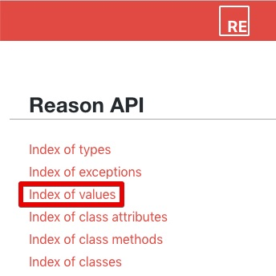

# ReasonML 學習指引

> 撰寫本文的動機在於，希望給具備 React Web Application 開發經驗的 JavaScript Developers 學習及導入 ReasonML 的快速上手指引。閱讀完本文及相關資源後，便可開始進行 ReasonML 的 React Web Application 開發。

## 起手入門

[ReasonML](https://reasonml.github.io/) 是由 Facebook 基於 [OCaml](https://ocaml.org/) 語言所發展出來的新語法（syntax）及工具鏈（toolchan）。OCaml 是一個發展至今已有 20 多年歷史的 Functional Programming Language 。現今 ReasonML 的一項重點應用即是 JavaScript / Web Development 。

請先依照以下步驟閱讀文件，閱讀完畢之後，便可對於語言及相關工具有基本認識：

1. 請前往 ReasonML 的「[What & Why](https://reasonml.github.io/docs/en/what-and-why)」開始逐章閱讀，完成後便會瞭解 ReasonML 這個語言。
2. 這裡可以想像 ReasonML 只是個「表面（syntax）」，「骨子（backend） 」是 OCaml，接下來是，Web Development 是如何產生 JavaScript 程式碼？以及如何與 JavaScript 交互作用？請前往 BuckleScript 的「[What & Why](https://bucklescript.github.io/docs/en/what-why) 」，讀完之後對於 BucketScript 產生 JavaScript 程式碼有更進一步的認識。
3. ReasonML 也支援 JSX，對 React 相容也很高，ReasonML 中撰寫 JSX / React 相較於 JavaScript 的 React 有些差異，更多詳細請前往 ReasonReact 的「[What & Why](https://reasonml.github.io/reason-react/docs/en/what-and-why)」。

除了上述文件之外，下列 2 個 API 文件往後的開發會時常交互查詢：

- [ReasonML API documentation](https://reasonml.github.io/api/)
- [BuckleScript API documentation](https://bucklescript.github.io/bucklescript/api/)

特別注意的地方是 BuckleScript API 範例中 function signature 是 OCaml 語法，若不習慣 OCaml 語法，可以安裝 [reason-tools](https://github.com/reasonml/reason-tools) 這套 [Chrome](https://chrome.google.com/webstore/detail/reason-tools/kmdelnjbembbiodplmhgfjpecibfhadd) / [FireFox](https://addons.mozilla.org/en-US/firefox/addon/reason-tools/) extension 即時切換語法方便閱讀。

Web Application 開發可以從 BuckleScript 所提供的 API 找起，例如 [Js](https://bucklescript.github.io/bucklescript/api/Js.html)、[Belt](https://bucklescript.github.io/bucklescript/api/Belt.html) 等模組，若找不到也可以從 ReasonML 所提供 API 尋找，例如 [Pervasives](https://reasonml.github.io/api/Pervasives.html)、[Printf](https://reasonml.github.io/api/Printf.html) 等模組 。

> 💡 API 文件有 index of values（[BuckleScript](https://bucklescript.github.io/bucklescript/api/index_values.html)、[ReasonML](https://reasonml.github.io/api/index_values.html)）可以列出所有支援的 functions，開啟頁面使用 Browser 內建搜尋字串快速尋找。
> 
 
## 如何撰寫 BuckleScript bindings？

對於採用 ReasonML 開發 Web Application，能夠沿用既有 JavaScript 十分重要，無論是 JS 的 3rd-party 函式庫或逃生用 JS code。

以下示範各種 bindings：

### Global variable

詳細可參考 https://bucklescript.github.io/docs/en/bind-to-global-values

Binding:

```re
[@bs.val] [@bs.scope ("location")] external href : string = "href";
```

JS Output:

```js
window.location.href
```

## Topics TBD

- Write unit test for component created by ReasonReact
- What’s ‘a, ‘b, etc. meaning on function signature? It’s difficult to understand API document.
- What’s .rmi extension? (ReasonML FAQ has answered)
- 有什麼好用的常用的 library, bs-json, graphQL ppx...
