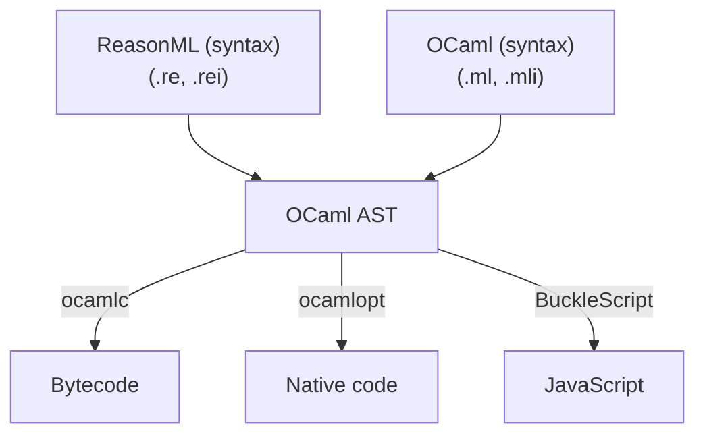
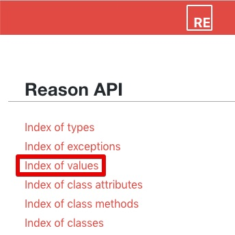
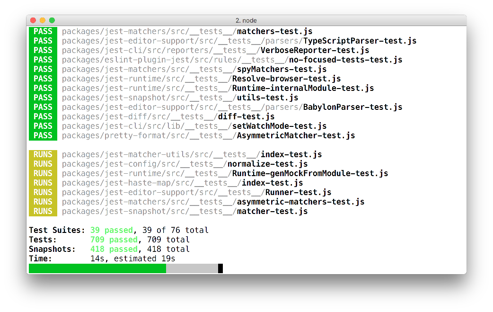
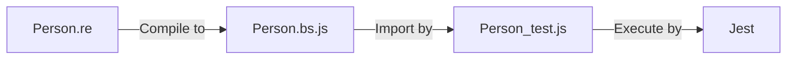
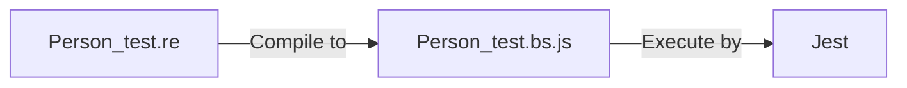

# ReasonML 學習指引

!> 撰寫本文的動機在於，希望給具備 React Web Application 開發經驗的 JavaScript Developers 學習及導入 ReasonML 的快速上手指引。閱讀完本文及相關資源後，便可開始進行 ReasonML 的 React Web Application 開發。

## 起手入門

[ReasonML](https://reasonml.github.io/) 是由 Facebook 基於 [OCaml](https://ocaml.org/) 語言所發展出來的新語法（syntax）及工具鏈（toolchan）。OCaml 是一個發展至今已有 20 多年歷史的 Functional Programming Language 。現今 ReasonML 的一項重點應用即是 JavaScript / Web Development 。


（圖片來源：http://2ality.com/2017/11/about-reasonml.html#what-is-reasonml ）

請先依照以下步驟閱讀文件，閱讀完畢之後，便可對於語言及相關工具有基本認識：

1. 請前往 ReasonML 的「[What & Why](https://reasonml.github.io/docs/en/what-and-why)」開始逐章閱讀，完成後便會瞭解 ReasonML 這個語言。
2. 這裡可以想像 ReasonML 只是個「表面（syntax）」，「骨子（backend） 」是 OCaml，接下來是，Web Development 是如何產生 JavaScript 程式碼？以及如何與 JavaScript 交互作用？請前往 BuckleScript 的「[What & Why](https://bucklescript.github.io/docs/en/what-why) 」，讀完之後對於 BuckleScript 產生 JavaScript 程式碼有更進一步的認識。
3. ReasonML 也支援 JSX，對 React 相容也很高，ReasonML 中撰寫 JSX / React 相較於 JavaScript 的 React 有些差異，更多詳細請前往 ReasonReact 的「[What & Why](https://reasonml.github.io/reason-react/docs/en/what-and-why)」。

除了上述文件之外，下列 2 個 API 文件往後的開發會時常交互查詢：

- [ReasonML API documentation](https://reasonml.github.io/api/)
- [BuckleScript API documentation](https://bucklescript.github.io/bucklescript/api/)

特別注意的地方是 BuckleScript API 範例中 function signature 是 OCaml 語法，若不習慣 OCaml 語法，可以安裝 [reason-tools](https://github.com/reasonml/reason-tools) 這套 [Chrome](https://chrome.google.com/webstore/detail/reason-tools/kmdelnjbembbiodplmhgfjpecibfhadd) / [FireFox](https://addons.mozilla.org/en-US/firefox/addon/reason-tools/) extension 即時切換語法方便閱讀。

Web Application 開發可以從 BuckleScript 所提供的 API 找起，例如 [Js](https://bucklescript.github.io/bucklescript/api/Js.html)、[Belt](https://bucklescript.github.io/bucklescript/api/Belt.html) 等模組，若找不到也可以從 ReasonML 所提供 API 尋找，例如 [Pervasives](https://reasonml.github.io/api/Pervasives.html)、[Printf](https://reasonml.github.io/api/Printf.html) 等模組 。

?> 💡 API 文件有 index of values（[BuckleScript](https://bucklescript.github.io/bucklescript/api/index_values.html)、[ReasonML](https://reasonml.github.io/api/index_values.html)）可以列出所有支援的 functions，開啟頁面使用 Browser 內建搜尋字串快速尋找。 <br/>
 
## 如何撰寫 BuckleScript bindings？

對於採用 ReasonML 開發 Web Application，能夠沿用既有 JavaScript 十分重要，無論是 3rd-party 函式庫或逃生出口（使用 JavaScript 撰寫再引入 ReasonML 中）。ReasonML 中若要「引入」JavaScript 程式，需要使用「Binding」方式以便使用。可以想像 Binding 類似 C 的 header，定義相對應 JavaScript 的 type definition。

以下示範幾種 JS 的 Bindings：

### 全域變數 e.g. `location.href` 

詳細可參考 https://bucklescript.github.io/docs/en/bind-to-global-values 。

```reason
[@bs.val] [@bs.scope ("location")] external href : string = "href";

Js.log(href);
/* 編譯出：console.log(location.href); */
```

*縮寫版本*

當省略 assigment 右邊雙引號內容時，變數名稱 `href` 就會視為雙引號內容。

```reason
[@bs.val] [@bs.scope ("location")] external href : string = "";

Js.log(href);
/* 輸出：console.log(location.href); */
```

### 全域模組 e.g. `Math.random` 

詳細可參考 https://bucklescript.github.io/docs/en/bind-to-global-values#global-modules 。

```reason
[@bs.val] [@bs.scope ("Math")] external random : unit => float = "random";

Js.log(random);
/* 輸出：console.log(Math.random()); */
```

### JS 的 "new" 關鍵字 + 內建 API e.g. `new Date()`

使用 `[@bs.new]` 模擬 JS 的 `new`，詳細可參考 https://bucklescript.github.io/docs/en/class#new 。

```reason
type t;
[@bs.new] external createDate : unit => t = "Date";

Js.log(createDate());
/* 輸出：console.log(new Date()); */
```

### JS 的 "new" 關鍵字 + 外部模組 e.g. `new MyModule()`

除了 `[@bs.new]`，外部模組需要額外 `[@bs.module]`。

```reason
type t;
[@bs.new] [@bs.module] external createMyModule : unit => t = "MyModule";

Js.log(createMyModule());
/* 
   輸出：
   var MyModule = require("MyModule");
   console.log(new MyModule()); 
*/
```

### 外部函式 e.g. `MyFunc(100)`

詳細請參考：https://bucklescript.github.io/docs/en/import-export#import-a-default-value

```reason
[@bs.module] external myFunc : int => int = "MyFunc";

Js.log(myFunc(100));
/* 
   輸出：
   var MyFunc = require("MyFunc");
   console.log(MyFunc(100));
*/
```

### 外部方法 e.g. `path.dirname("...")`

詳細請參考：https://bucklescript.github.io/docs/en/import-export#import

```reason
[@bs.module "path"] external dirname : string => string = "dirname";

Js.log(dirname("/foo/bar/baz/"));
/* 
   輸出：
   var path = require("path");
   console.log(path.dirname("/foo/bar/baz/"));
*/
```

### ES6 模組 e.g. `import es from 'es'`

詳細請參考：https://bucklescript.github.io/docs/en/import-export#import-a-default-value

```reason
[@bs.module "MyFuncES"] external myFuncES : int => int = "default";

Js.log(myFuncES(100));
/* 
   輸出：
   var MyFuncES = require("MyFuncES");
   console.log(MyFuncES.default(100));
*/
```

## ReasonML 如何撰寫 React Component 測試？


## 推薦 React Development 好用的函式庫 / ppx 

### `glennsl/bs-json`: JSON Encode / Decode 函式庫

* 官方網址：https://github.com/glennsl/bs-json

現今 Web Development 幾乎都會需要面對 JSON 的處理，ReasonML / BuckleScript 也有幾種方式可以處理。

#### 仿真 `JSON.parse` / `JSON.stringify`

!> 不推薦，最後採用的方法。

使用 `[@bs.deriving abstract]` 來仿真 JavaScript 的 `JSON.parse`。

以下 `JSON.parse` 擷取自 [JSON](https://bucklescript.github.io/docs/en/json) 章節：

```reason
[@bs.deriving abstract]
type data = {name: string};

[@bs.scope "JSON"] [@bs.val]
external parseIntoMyData : string => data = "parse";

let result = parseIntoMyData("{\"name\": \"Luke\"}");
let n = result->name;
```

產生結果：

```javascript
var result = JSON.parse("{\"name\": \"Luke\"}");
var n = result.name;
```

?> `JSON.stringify` 請參考 `Js.Json` 的 stringify。

#### `Js.Json`

`Js.Json` 模組為 BuckleScript 內建模組之一，優點可以直接使用，但使用上較為複雜。

以下示範 parse JSON：

```reason
/* JSON string */
let data = {|{ "name": "Luke Skywalker" }|};

/* 進行 JSON.parse，若有任何錯誤，丟出例外 */
let json =
  try (Js.Json.parseExn(data)) {
  | exn =>
    /* 輸出例外並傳回 null */
    Js.Console.error(exn);
    Js.Json.null;
  };

/* 取得 "name" 這個欄位的值 */
let name: option(string) =
  switch (Js.Json.classify(json)) {
  | JSONFalse
  | JSONTrue
  | JSONNull
  | JSONString(_)
  | JSONNumber(_)
  | JSONArray(_) => None
  | JSONObject(dict) =>
    switch (Js.Dict.get(dict, "name")) {
    | None => None
    | Some(string) => Js.Json.decodeString(string)
    }
  };

switch (name) {
| Some(v) => v
| None => "N/A"
}
/* 輸出：Luke Skywalker */
```

以下示範 **stringify**：

```reason
/* tuple: (string, Js.Json.t)*/
let name = ("name", Js.Json.string("Luke Skywalker"));
let dict = [name] |> Js.Dict.fromList;
let data = dict |> Js.Json.object_ |> Js.Json.stringify;

Js.log(data);
/* 輸出：{"name":"Luke Skywalker"} */
```

#### `bs-json`

?> 推薦使用。

[bs-json](https://github.com/glennsl/bs-json) 由 [glennsl](https://github.com/glennsl/) 所撰寫開發的函式庫。提供更簡潔方便的 Decode / Encode 寫法。

下列示範 JSON parse：

```reason
/* JSON string */
let data = {|{ "name": "Luke Skywalker", "height": 172 }|};

/* 對應的 record type */
type person = {
  name: string,
  height: int,
};

let decoder = json => {
  open! Json.Decode;
  {
    name: json |> field("name", string),
    height: json |> field("height", int)
  }
};

let actual =  data |> Json.parseOrRaise |> decoder;

Js.log(actual.name);
/* 輸出：Luke Skywalker */
```

### `glennsl/bs-jest`: Jest 的 BuckleScript bindings

[Jest](https://jestjs.io/) 是一套 JavaScript 的測試 runner，可以用來撰寫 unit / integration test，另外內建包含 coverage、assertions、mocks 及 snapshots 等功能，API 支援十分完善且有極佳的開發體驗。



（圖片來源：https://jestjs.io/en/ ）

[bs-jest](https://github.com/glennsl/bs-jest) 為 Jest 在 BuckleScript 的 Binding，由 [glennsl](https://github.com/glennsl/) 所撰寫開發。這個 Binding 支援大部份的 Jest API。使用 ReasonML 開發 Web Development 經常使用 "record type" 或 "variant type" 等，若使用 JavaScript 撰寫測試程式碼，會需要用到許多 JS 與 ReasonML 之間的轉換，徒增不少開發困擾，因此建議使用 `bs-jest` 配上 Jest 撰寫測試。

例如，撰寫 `getPersonName` 的單元測試：

```reason
/* Person.re */
type person = {
  firstName: string,
  lastName: string,
};

type field =
  | First
  | Last;

let getPersonName = (targetField: field, data: person): string =>
  switch (targetField) {
  | First => data.firstName
  | Last => data.lastName
  };
```

若要使用 JavaScript 撰寫測試，需要特別使用的 `bs` attribute，才能在 JavaScript 中使用：

1. `type person` 上方加入 `[@bs.deriving jsConverter]` (詳細參考 [jsConverter](https://bucklescript.github.io/docs/en/generate-converters-accessors#convert-between-jst-object-and-record))
2. `type field` 上方加入 `[@bs.deriving accessors]` (詳細參考 [accessors](https://bucklescript.github.io/docs/en/generate-converters-accessors#functions-plain-values-for-variant))

加入後結果如下：

```reason
/* Person.re（給 JavaScript 撰寫測試的版本） */
[@bs.deriving jsConverter]
type person = {
  firstName: string,
  lastName: string,
};

[@bs.deriving accessors]
type field =
  | First
  | Last;

/* ...下略... */
```

使用 JavaScript 撰寫的測試如下（假設 ReasonML 編譯後檔名為 `Person.bs.js`）：

```javascript
/* person_test.js */
const person = require('./Person.bs');

test('getPersonName, field = firstName', () => {
  // 使用 jsConverter 將 Plain Object 轉成 ReasonML record
  const data = person.personFromJs({ firstName: 'Archie', lastName: 'Lee' });
  // 使用 accessors 取得特定的 ReasonML variant type
  const field = person.first;
  // 最後，才是實際調用函式並帶入參數
  const actual = person.getPersonName(field, data);

  expect(actual).toEqual('Archie');
});
```

流程順序如下：



---

若是直接使用 ReasonML 撰寫測試，不需要額外 `bs` attribute，測試的程式碼也較精簡直覺：

```reason
/* Person_test.re */
open Jest;
open Expect;

test("getPersonName, field = firstName", () => {
  let data = Person.{ firstName: "Archie", lastName: "Lee" };
  let field = Person.First;
  let actual = Person.getPersonName(field, data);

  actual |> expect |> toEqual("Archie");
});
```

流程簡化許多：



### `mhallin/graphql_ppx`: BuckleScript / ReasonML 的 GraphQL 語法擴充 

* 官方網址：https://github.com/mhallin/graphql_ppx

## FAQ

- What’s ‘a, ‘b, etc. meaning on function signature? It’s difficult to understand API document.

